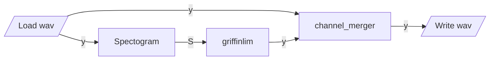
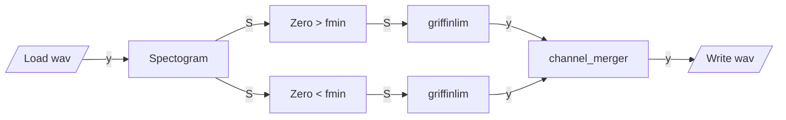
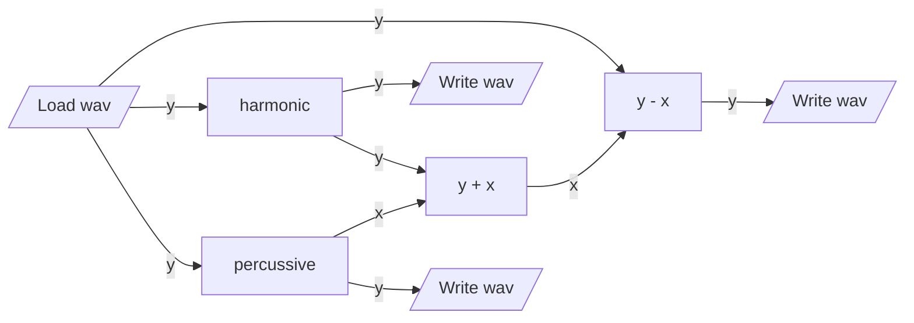

# python-librosa

## Operations

## `griffinlim`

## `griffinlim_filter`

[](https://mermaid-js.github.io/mermaid-live-editor/#/edit/eyJjb2RlIjoiZ3JhcGggTFJcbiAgbG9hZFsvTG9hZCB3YXYvXSAtLT58eXxzcGVjdG9ncmFtW1NwZWN0b2dyYW1dXG4gIHNwZWN0b2dyYW0tLT58U3x6ZXJvc19ocFtaZXJvID4gZm1pbl1cbiAgemVyb3NfaHAgLS0-fFN8Z3JpZmZpbmxpbV9ocFtncmlmZmlubGltXVxuICBncmlmZmlubGltX2hwLS0-fHl8Y2hhbm5lbF9tZXJnZXJcblxuICBzcGVjdG9ncmFtLS0-fFN8emVyb3NfbHBbWmVybyA8IGZtaW5dXG4gIHplcm9zX2xwIC0tPnxTfGdyaWZmaW5saW1fbHBbZ3JpZmZpbmxpbV1cbiAgZ3JpZmZpbmxpbV9scC0tPnx5fGNoYW5uZWxfbWVyZ2VyXG5cbiAgY2hhbm5lbF9tZXJnZXItLT58eXx3cml0ZVsvV3JpdGUgd2F2L10iLCJtZXJtYWlkIjp7InRoZW1lIjoiZGVmYXVsdCJ9LCJ1cGRhdGVFZGl0b3IiOmZhbHNlfQ)

## `hpss`

[](https://mermaid-js.github.io/mermaid-live-editor/#/edit/eyJjb2RlIjoiZ3JhcGggTFJcbiAgbG9hZC0tPnx5fHJlc2lkdWFsW3kgLSB4XVxuICBsb2FkWy9Mb2FkIHdhdi9dIC0tPnx5fGhhcm1vbmljW2hhcm1vbmljXVxuICBoYXJtb25pYy0tPnx5fHdyaXRlXzBbL1dyaXRlIHdhdi9dXG5cbiAgaGFybW9uaWMgLS0-fHl8YWRkW3kgKyB4XVxuICBsb2FkIC0tPnx5fHBlcmNbcGVyY3Vzc2l2ZV1cbiAgcGVyYyAtLT58eHxhZGRbeSArIHhdXG4gIGFkZCAtLT4gfHh8cmVzaWR1YWxcbiAgcmVzaWR1YWwgLS0-fHl8d3JpdGVfMlsvV3JpdGUgd2F2L11cbiAgcGVyYy0tPnx5fHdyaXRlXzFbL1dyaXRlIHdhdi9dXG4gICIsIm1lcm1haWQiOnsidGhlbWUiOiJkZWZhdWx0In0sInVwZGF0ZUVkaXRvciI6ZmFsc2V9)

